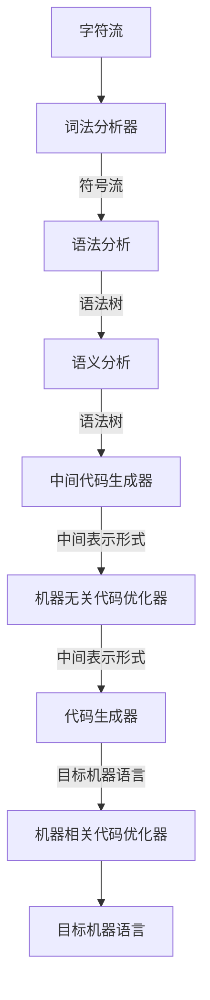

# Compile


词法分析器: 读入字符流，组成成有意义上的词素，产生<token_name, token_value>
语法分析: 生成语法树
语义分析： 重要组成部分类型检查

## 语法定义
描述程序设计语言的表示方法，上下文无关文法。文法描述了程序语言的层次结构

比如if...else... 条件语句可以表示为
```c++
stmt -> if (expr) stmt else stmt
```
`->`表示可以具有如下形式
关键字`if`、`else`可以称为**终结符号**，expr和stmt表示终结符号的序列，称为非终结符号。

一个上下文无关文法由以下4部分组成
- 终结符号的集合，词法单元
- 非终结符号的集合，词法变量