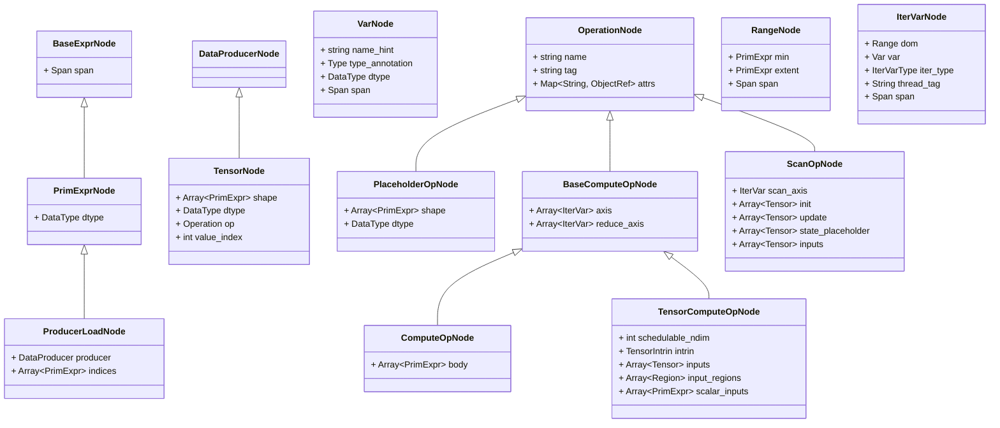
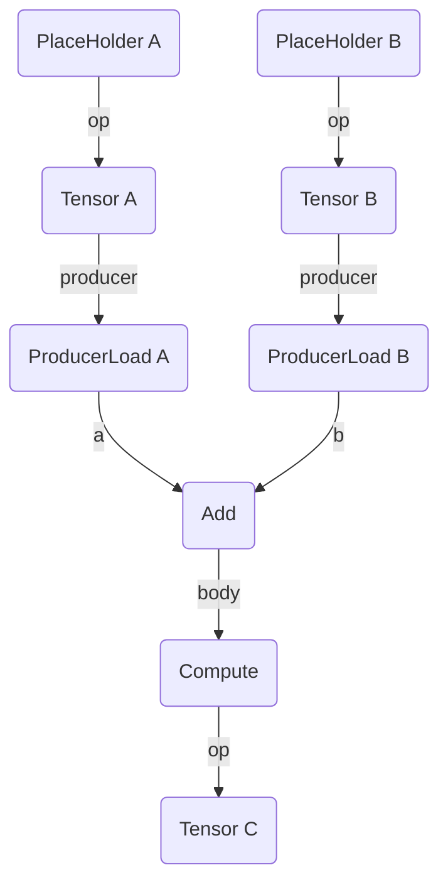
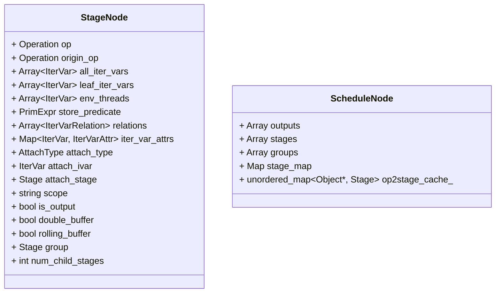
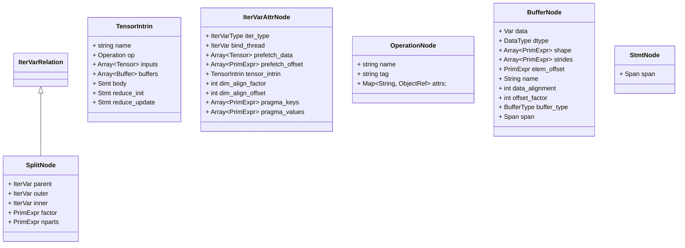

# Schedule

考虑以下op生成如下

```python
import tvm
from tvm import te

n = te.var("n")
m = te.var("m")

A = te.placeholder((m), name="A")
B = te.placeholder((m), name="B")
C = te.compute((m), lambda i, j: A[i] + B[i], name="C")

s = te.create_schedule([C.op])

print(tvm.lower(s, [A, B, C], simple_mode=True))
```

te.var，注册tir.Var， 实体VarNode

te.placeholder: 注册te.Placeholder， 实体TensorNode， 对于ptyhon Tensor类进行索引取值触发产生`TensorSlice` 操作，`TensorSlice`的asobject在通过ffi接口传递给c函数被调用到调用到`Tensor`的`__call__`方法产生`ProducerLoad`，给对应的op进行操作。TensorSlice在C++代码中是没有实体的，如果要说其对应的实体则是ProduceLoader

tir.IterVar: 注册tir.IterVar，实体IterVarNode

ComputeOp: 注册te.ComputeOp, 实体ComputeOpNode

ProducerLoad: 通常发生于对Tensor






根据以上我们可以得到如上所示的tir图，`s = te.create_schedule([C.op])`，然后就是生成Schedule。

首先补充一下在TE层被称为Operation的只有`PlaceholderOp`、`ComputeOp`、`TensorComputeOp`、`ScanOp`、`ExternOp`、`HybridOp`。

目前大部分场景下构造出来的也只有`PlaceholderOp`、`ComputeOp`。

CreateReadGraph的返回值为`using ReadGraph = Map<Operation, Array<Tensor> >;`，即对应的ComputeOp和其输入Tensor, Placehoder自身没有输入Tensor。在返回的ReadGraph中为`ComputeOp`和其输入`Tensor`， `Placeholder`和`{}`的map。

PostDFSOrder 返回按照DFS遍历的OperationNode结果，在上图中预期产生的Operation 为`{Placeholder A, Placeholder B, ComputeC}`

所以从目前看ScheduleNode就是一系列的关联OperationNode的Stage

```c++
Schedule::Schedule(Array<Operation> ops)
{
    auto n = make_object<ScheduleNode>();
    data_ = n;
    n->outputs = ops;
    // 获取到节点和其相关联的输入
    auto g = te::CreateReadGraph(n->outputs);
    // placeholderA, placeholderB, computeOpC
    Array<Operation> post_order = te::PostDFSOrder(n->outputs, g);
    std::unordered_set<Operation> output_set;
    for (Operation x : ops) {
        output_set.insert(x);
    }
    // 根据DFS遍历出来的顺序生成Stage
    for (Operation op : post_order) {
        Stage stage(op);
        stage->is_output = output_set.count(op) != 0;
        n->stages.push_back(stage);
        // op和stage的map, {placeholderA: stage1, placeholderB: stage2, computeOpC: stage3}
        n->stage_map.Set(op, stage);
		// scanOp的特殊处理，这里不涉及scan
        if (const ScanOpNode *scan = op.as<ScanOpNode>()) {
            Array<Tensor> inputs;
            for (Tensor t : scan->state_placeholder) {
                inputs.push_back(t);
            }
            for (Tensor t : scan->inputs) {
                inputs.push_back(t);
            }
            // Create the scan group.
            Stage scan_group = this->create_group(scan->update, inputs, false);
            scan_group->attach_type = kScanUpdate;
            scan_group->attach_stage = stage;

            for (size_t i = 0; i < scan->update.size(); ++i) {
                Stage s = n->stage_map[scan->update[i]->op];
                ICHECK(scan_group.same_as(s->group));
            }
        }
    }
}
```




接下来再看`tvm.lower(s, [A, B, C], simple_mode=True)`


其本质调用的是`LowerSchedule`

```c++
IRModule LowerSchedule(te::Schedule sch, const Array<ObjectRef>& args, const std::string& name,
                       const std::unordered_map<te::Tensor, tir::Buffer>& binds, bool simple_mode) {
  IRModule mod = ScheduleToModule(std::move(sch), args, name, binds);
  // Get the legacy TE pass list
  Array<transform::Pass> pass_list = CreatePassList(simple_mode);
  return LowerWithPassList(mod, pass_list);
}
```

在`ScheduleToModule`函数内首先会调用Schedule::normlize

```c++
Schedule Schedule::normalize() {
  Schedule sn = copy();
  // 不涉及， 以上操作没有使用，推测应该是对于Inline的Stage进行操作的
  InjectInline(sn.operator->(), false);
  RebaseNonZeroMinLoop(sn.operator->());
  LegalizeInvalidAttach(sn.operator->());
  return sn;
}
```


