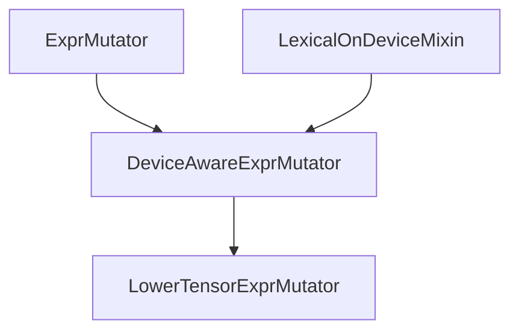

# CodeGen

tvm 在拿到relay进行以一系列的OptimizeImpl之后会进行Codegen，使用的executor为GraphExecutorCodegen。即Relay转换为TIR.

```c++
void BuildRelay(IRModule relay_module, const String &mod_name) {
    ...
    relay_module = OptimizeImpl(std::move(relay_module));

    ...
    // Generate code for the updated function.
    executor_codegen_ = MakeExecutorCodegen(executor_->name);
    executor_codegen_->Init(nullptr, config_->legacy_target_map);
    executor_codegen_->Codegen(func_module, func, mod_name);
    executor_codegen_->UpdateOutput(&ret_);
    ret_.params = executor_codegen_->GetParams();

    auto lowered_funcs = executor_codegen_->GetIRModule();
    ...
}
```

目前存在的Codegen在tvm中主要是[`AOTCodegen`](https://discuss.tvm.apache.org/t/implementing-aot-in-tvm/9206)和`GraphCodegen`。正常情况下走的是GraphExecutorCodeGen。这里使用opt_level=0主要观察codegen主要是做了啥, 一下是codegen之前的relay ir，可以看到所有的op都没有进行了融合。

```c++
def @main(%data: Tensor[(32, 784), float32], param_se_scopes=[SEScope(device_type=1, virtual_device_id=0, target=Target(kind='llvm', keys={'cpu'}, attrs={'link-params': (bool)0}, host=Target(kind='llvm', keys={'cpu'}, attrs={'link-params': (bool)0})))], result_se_scope=SEScope(device_type=1, virtual_device_id=0, target=Target(kind='llvm', keys={'cpu'}, attrs={'link-params': (bool)0}, host=Target(kind='llvm', keys={'cpu'}, attrs={'link-params': (bool)0}))), hash="d83209c04c4d490c") -> Tensor[(32, 10), float32] {
  %0 = fn (%p019: Tensor[(32, 784), float32], Primitive=1, relay.reshape_only=1, hash="95efca4db2158ba4") -> Tensor[(32, 28, 28, 1), float32] {
    reshape(%p019, newshape=[-1, 28, 28, 1]) /* Reshape */ /* ty=Tensor[(32, 28, 28, 1), float32] */
  };
  %1 = %0(%data) /* ty=Tensor[(32, 28, 28, 1), float32] */;
  %2 = fn (%p018: Tensor[(32, 28, 28, 1), float32], %p110: Tensor[(5, 5, 1, 32), float32], hash="0e1fd5f81de65de5", data_layout="NHWC", kernel_layout="HWIO", Primitive=1, out_layout="") -> Tensor[(32, 28, 28, 32), float32] {
    nn.conv2d(%p018, %p110, padding=[2, 2, 2, 2], channels=32, kernel_size=[5, 5], data_layout="NHWC", kernel_layout="HWIO") /* conv1/Conv2D */ /* ty=Tensor[(32, 28, 28, 32), float32] */
  };
  %3 = fn (%p023: Tensor[(32), float32], %p113: float32, Primitive=1, hash="85ca91fe9057771b") -> Tensor[(32), float32] {
    add(%p023, %p113) /* ty=Tensor[(32), float32] */
  };
  %4 = %3(meta[relay.Constant][1] /* ty=Tensor[(32), float32] */, 0.001f /* ty=float32 */) /* ty=Tensor[(32), float32] */;
  %5 = fn (%p022: Tensor[(32), float32], Primitive=1, hash="9056ed434d7a90e4") -> Tensor[(32), float32] {
    sqrt(%p022) /* ty=Tensor[(32), float32] */
  };
  %6 = %5(%4) /* ty=Tensor[(32), float32] */;
  %7 = fn (%p021: float32, %p112: Tensor[(32), float32], Primitive=1, hash="a594e3a2d400dd46") -> Tensor[(32), float32] {
    divide(%p021, %p112) /* ty=Tensor[(32), float32] */
  };
  %8 = %7(1f /* ty=float32 */, %6) /* ty=Tensor[(32), float32] */;
  %9 = fn (%p020: Tensor[(32), float32], %p111: Tensor[(32), float32], Primitive=1, hash="c3a46c9c4e5b4441") -> Tensor[(32), float32] {
    multiply(%p020, %p111) /* ty=Tensor[(32), float32] */
  };
...
}
```

在进过codegen之后产生的lower_func变成了下面这样

```c++
...
, GlobalVar(tvmgen_default_fused_add_8): PrimFunc([placeholder, placeholder, T_add]) attrs={"from_legacy_te_schedule": (bool)1, "global_symbol": "tvmgen_default_fused_add_8", "tir.noalias": (bool)1, "target": llvm -keys=cpu -link-params=0} {
  parallel (ax0.ax1.fused, 0, 32) {
    for (ax3.outer, 0, 64) {
      T_add[ramp(((ax0.ax1.fused*1024) + (ax3.outer*16)), 1, 16)] = (placeholder[ramp(((ax0.ax1.fused*1024) + (ax3.outer*16)), 1, 16)] + placeholder[ramp((ax3.outer*16), 1, 16)])
    }
  }
}
, GlobalVar(tvmgen_default_fused_divide_1): PrimFunc([placeholder, placeholder, T_divide]) attrs={"from_legacy_te_schedule": (bool)1, "global_symbol": "tvmgen_default_fused_divide_1", "tir.noalias": (bool)1, "target": llvm -keys=cpu -link-params=0} {
  parallel (ax0.outer, 0, 4) {
    T_divide[ramp((ax0.outer*16), 1, 16)] = (x16(placeholder[0])/placeholder[ramp((ax0.outer*16), 1, 16)])
  }
}
, GlobalVar(tvmgen_default_fused_reshape_1): PrimFunc([placeholder, T_reshape]) attrs={"from_legacy_te_schedule": (bool)1, "global_symbol": "tvmgen_default_fused_reshape_1", "tir.noalias": (bool)1, "target": llvm -keys=cpu -link-params=0} {
  parallel (ax0, 0, 32) {
    for (ax1.outer, 0, 196) {
      T_reshape[ramp(((ax0*3136) + (ax1.outer*16)), 1, 16)] = placeholder[ramp(((ax0*3136) + (ax1.outer*16)), 1, 16)]
    }
  }
}
...
```

可以看到这里的都是叫做`PrimFunc`的函数，`PrimFunc`作为一等公民存在。在其内部定义中buffer_map属性作为`PrimFunc`的一等公民存在。PrimFunc也是类似于Relay层的Function一样。包含了入参params， body函数实现，ret_type返回类型，buffer_map用来分析程序的内存分配使用情况。

```c++
class PrimFuncNode : public BaseFuncNode {
public:
    /*! \brief Function parameters */
    Array<tir::Var> params;
    /*! \brief The body of the function */
    tir::Stmt body;
    /*! \brief The return type of the function. */
    Type ret_type;
    /*!
     * \brief Maps some parameters to specific Buffer data structures.
     *
     *  buffer_map provides a way to express data structure's field and shape
     *  constraints. The provided information is used in the program analysis
     *  and the code generation.
     *
     *  - It defines the vars in the Buffer (m, n) in the cases below when
     *    they appears in the buffer_map for the first time.
     *  - When a var appears multiple times, they translate into runtime
     *    assertion to check the field constraint.
     *
     *  \code
     *
     *   # The corresponding fields of f are as follows
     *   #
     *   # - f.params = [a, b]
     *   # - f.buffer_map = {a: A, b: B}
     *   # - A = decl_buffer(shape=[m, n])
     *   # - B = decl_buffer(shape=[m, n])
     *
     *   def f(a, b):
     *       m, n = var(), var()
     *       A = bind_buffer(a, shape=[m, n])
     *       B = bind_buffer(b, shape=[m, n])
     *       # body
     *
     *  \endcode
     *
     *  buffer_map is a sugar to express:
     *  - Parameter unpacking: e.g. I can load a.shape[0] to get value of m
     *  - Constraint checking: a.shape[0] must equal b.shape[0] because they
     *    both corresponds to m.

     *  While we could have express parameter unpacking and constraint using
     *  normal statements, making buffer_map as first class citizen of PrimFunc
     *  will make program analysis much easier.
     */
    Map<tir::Var, Buffer> buffer_map;

};


class VarNode : public PrimExprNode {
 public:
  /*!
   * \brief The hint to the variable name.
   * \note Each variable is uniquely identified by its address.
   */
  String name_hint;
  /*!
   * \brief type annotaion of the variable.
   *
   * It is an optional field that provides a refined type of the variable than dtype.
   *
   * \sa tvm/ir/type.h for discussion of relations between runtime::DataType and Type.
   */
  Type type_annotation;

};
```

`tir.var`也是`relay.var`类似只包含了变量的名称。没有必要过多的关注。

然后是`StmtNode`， 很多的类继承了`StmtNode`。定义在`include/tvm/tir/stmt.h`。主要存在类`LetStmtNode`、`AttrStmtNode`、`AssertStmtNode`、`StoreNode`、`BufferStoreNode`、`BufferRealizeNode`、`ProducerStoreNode`、`ProducerRealizeNode`、`AllocateNode`、`SeqStmtNode`、`IfThenElseNode`、`EvaluateNode`、`ForNode`、`WhileNode`、`PrefetchNode`、`BlockNode`、`BlockRealizeNode`用以上节点来表示生成代码中的循环等一系列操作。以上的定义就是一个AST的定义，通过将op在schedule中转化为对应的AST，然后生成lowered代码。

这里不做过多深入，只需要知道codegen 是将原始的高层的op，变为基础的加减乘除，循环条件判断等的基础算法操作。

其Codegen流程可以看到上来先`GraphPlanMemory`，然后执行了`LowerTEPass`，然后在进行一把`GraphPlanMemory`。最后将param和graph_json以及生成的lower_func返回。

```c++
LoweredOutput Codegen(IRModule mod, relay::Function func, String mod_name)
{
    mod_name_ = mod_name;
    memory_plan_ = GraphPlanMemory(func);

    backend::FunctionInfo func_info;
    ...

    IRModule lowered_mod = tec::LowerTEPass(
        mod_name_,
        [this](BaseFunc func)
        {
            // We need to maintain the constant map for external
            // functions so we pass this processing function which
            // allows us to process each function as we lower it.
            if (func->GetAttr<String>(attr::kCompiler).defined())
            {
                UpdateConstants(func, &params_);
            }

            // TODO(@areusch, @jroesch): We should refactor this to
            // execute as a further pass, instead writing data to the
            // lowering process directly.
            tec::UpdateFunctionMetadata(func, this->function_metadata_);
        },
        config->host_se_scope)(mod);

    Optional<backend::FunctionInfo> main_func_info =
        lowered_mod->GetAttr<backend::FunctionInfo>("main_func_info");

    function_metadata_.Set(runtime::symbol::tvm_module_main, main_func_info.value());

    Function lowered_main_func = Downcast<Function>(lowered_mod->Lookup("main"));

    // Now that we have lowered all operators to TIR code, we can proceed with compilation.
    //
    // We need to unfortunately re-plan as the previous results have been invalidated by lowering
    // we will fix this in future refactors.
    memory_plan_ = GraphPlanMemory(lowered_main_func);
    ...

    dmlc::JSONWriter writer(&os);
    GetJSON(&writer);
    LoweredOutput ret;
    ret.graph_json = os.str();
    ret.params = std::unordered_map<std::string, std::pair<int, const tvm::runtime::NDArray>>();
    ...
    // This is the point where we separate the functions in the module by target
    ret.lowered_funcs = tec::GetPerTargetModules(lowered_mod);
    return ret;
}
```

所以在Lower的过程中核心的的操作步骤只有两步`LowerTEPass`和`GraphPlanMemory`。`LowerTE`主要分为两步，第一步是将`Primitive`类型的生成lower代码，第二步是将`Compiler`类型的函数调用对应的codegen。

```c++
Pass LowerTEPass(const String& module_name, ProcessFn process_fn, SEScope host_se_scope) {
  runtime::TypedPackedFunc<IRModule(IRModule, PassContext)> pass_func = [=](IRModule module,
                                                                            PassContext ctx) {
    return LowerTE(module, module_name, process_fn, host_se_scope);
  };
  // RelayToTIRTargetHook 基本没啥用, 在某些Target上有用。
  return tvm::transform::Sequential(
      {tvm::relay::transform::RelayToTIRTargetHook(),
       tvm::transform::CreateModulePass(pass_func, 0, "LowerTE", {"InferType"}), InferType()});
}

IRModule LowerTE(const IRModule &module, const String &module_name, ProcessFn process_fn,
                 SEScope host_se_scope) {
    TECompiler compiler(module);

    // TODO(mbs): This is all unnecessarily convoluted. Better would be to accumulate the rewritten
    // module as we go (including rewritten Functions, lowered primitives, and runtime modules
    // generated by external toolchains), and use a pair of maps over vars and global vars
    // to global vars to remember which functions have already been lowered.

    // Lower all the callees in module:
    //  - Functions tagged with "Compiler" are unchanged (checked by CreateFunctionPass)
    //  - Functions tagged with "Primitive" are unchanged (checked by LowerTensorExprMutator)
    //  - Called functions tagged with "Compiler" are copied into the compiler cache with a fresh
    //    GlobalVar, and calls updated (sticking with regular Relay Call).
    //  - Calls to functions tagged with "Primitive" are compiled to PrimFuncs, and calls updated
    //    (using call_lowered convention).
    IRModule updated_module = LowerTensorExpr(module_name, compiler, std::move(process_fn),
                                              std::move(host_se_scope))(module);

    // The Functions tagged with "Compiler" are now residing in the cache ready to be
    // compiled by LowerExternalFunctions. However we still need a record of them in the
    // IRModule so that the various executors can see which function names need to be
    // retrieved. They may, however, have been renamed.
    compiler->AddExterns(updated_module);

    // Add the lowered functions.
    IRModule lowered_module = compiler->GetLoweredFunctions();
    for (const auto &kv : lowered_module->functions)
    {
        updated_module->Add(kv.first, kv.second);
    }

    // Invoke external codegen for all Functions in the cache tagged with "Compiler", and
    // annotate the module with the resulting runtime modules.
    // TODO(mbs): runtime modules should be first class rather than attributes.
    Array<runtime::Module> external_mods =
        module->GetAttr<Array<runtime::Module>>("external_mods", Array<runtime::Module>()).value();
    Array<runtime::Module> new_external_mods = compiler->LowerExternalFunctions();
    for (const auto &mod : new_external_mods) {
        external_mods.push_back(mod); // copy-on-write.
    }

    // Annotate the module with C Device API context mapping (this is until we have Targets
    // annotated for the C Device API)
    updated_module = WithAttrs(updated_module, {{"external_mods", std::move(external_mods)},
                                                {"device_contexts", std::move(device_contexts)}});

    ...
    return updated_module;
}

/*!
 * \brief Rewrites call expressions to Relay Functions marked as "primitive"
 * to calls to the corresponding TIR PrimFunc for the appropriate target.
 *
 * \code
 * %0 = fn(...) { prim_op(...) }     OR   let %p = fn(...) { prim_op(...) }
 * ... %0(...) ...                        ... %p(...) ...
 * ==>
 * def @q(..., target=<target>) { <tir body> }
 * ... @q(...) ...
 * \endcode
 *
 * Requires FuseOps, ToANormalForm, EtaExpand and InferType to have run.
 *
 * FuseOps is needed to identify and lift all prim op calls:
 * \code
 * ... prim_op(...) ...
 * ==>
 * %0 = fn(...) { prim_op(...) }
 * ... %0(...) ...
 * \endcode
 *
 * ToANormalForm is needed so we only need to consider vars and function literals as the call
 * target.
 *
 * EtaExpand is needed to ensures all calls to primitives are direct:
 * \code
 * let %p1 = fn(...) { prim_op1(...) }
 * let %p2 = fn(...) { prim_op2(...) }
 * let %p = if (...) { %p1 } else { %p2 }
 * ... %p(...) ...
 * ==>
 * let %p1 = fn(...) { prim_op1(...) }
 * let %p2 = fn(...) { prim_op2(...) }
 * let %p = fn(...) { if (...) { %p1(...) } else { %p2(...) } }
 * ... %p(...) ...
 * \endcode
 */
Pass LowerTensorExpr(const String& module_name, TECompiler compiler, ProcessFn process_fn,
                     SEScope host_se_scope) {
  runtime::TypedPackedFunc<Function(Function, IRModule, PassContext)> pass_func =
      [=](Function func, IRModule module, PassContext ctx) {
        LowerTensorExprMutator lower_te(module, process_fn, module_name, compiler, host_se_scope);
        return Downcast<Function>(lower_te.Mutate(func));
      };
  return CreateFunctionPass(pass_func, 0, "LowerTensorExpr", {});
}
```

我们可以看到`LowerTensorExprMutator`的作用是将所有标记为`primitive`的调用对应的转变为调用对应的对应target上TIR PrimFunc。关于这个Pass的继承关系树如下所示，包含了ExprMutator即DFS遍历节点进行修改



对于`DeviceAwareExprMutator`主要就是一个带有函数调用深度、函数调用device scope、依赖变量scope的遍历器

```c++
void LexicalOnDeviceMixin::EnterFunctionBody() { ++function_nesting_; }

void LexicalOnDeviceMixin::ExitFunctionBody() {
  ICHECK_GT(function_nesting_, 0);
  --function_nesting_;
}

void LexicalOnDeviceMixin::PushSEScope(const SEScope& se_scope) {
  if (se_scope->IsFullyUnconstrained()) {
    return;
  }
  expr_se_scopes_.emplace_back(se_scope);
}

void LexicalOnDeviceMixin::PopSEScope() {
  if (expr_se_scopes_.empty()) {
    return;
  }
  expr_se_scopes_.pop_back();
}

void LexicalOnDeviceMixin::PushBoundVar(Var var, const SEScope& se_scope) {
  if (se_scope->IsFullyUnconstrained()) {
    return;
  }
  ICHECK(var_se_scopes_.find(var) == var_se_scopes_.end());
  var_se_scopes_.emplace(std::move(var), se_scope);
}

void LexicalOnDeviceMixin::PopBoundVar(const Var& var) {
  auto itr = var_se_scopes_.find(var);
  if (itr == var_se_scopes_.end()) {
    return;
  }
  var_se_scopes_.erase(itr);
}
```

根据其实现可以在处理某个函数的时候得知此时的函数调用栈深度，调用发生在什么设备上，以便于后面是否拷贝数据从不同设备之间。

`DeviceAwareExprMutator` 定义了针对`FunctionNode`、`LetNode`、`CallNode`的`VisitExpr_`的遍历操作。

```c++
class DeviceAwareExprMutator : public ExprMutator, public LexicalOnDeviceMixin {
 public:
  explicit DeviceAwareExprMutator(const Optional<IRModule>& maybe_mod) : LexicalOnDeviceMixin(maybe_mod) {}

  Expr VisitExpr_(const FunctionNode* function_node) final;
  virtual Expr DeviceAwareVisitExpr_(const FunctionNode* function_node);

  Expr VisitExpr_(const CallNode* call_node) final;
  virtual Expr DeviceAwareVisitExpr_(const CallNode* call_node);

  Expr VisitExpr_(const LetNode* let_node) final;
  virtual void PreVisitLetBlock_(const LetNode* let_node);
  virtual std::pair<Var, Expr> PreVisitLetBinding_(const Var& var, const Expr& value);
  virtual Expr PostVisitLet_(const LetNode* pre_let_node, const LetNode* post_let_node);
  virtual Expr PostVisitLetBlock_(const LetNode* pre_let_node, const LetNode* post_let_node);
};
```

对于其`VisitExpr`基本不用重写覆盖，主要要重写覆盖的是剩下的这些方法。这里就就不详细展开除了CallNode之后的`DeviceAwareVisitExpr_`，Lower这个操作主要就是对CallNode的op进行操作。最终调用的是`TECompilerImpl`的`LowerInternal`函数实现，本质上是进行了`LowerSchedule`的操作，将Schedule转变为mod, 然后再经过一些tir Pass优化。在这之前有一步叫做`PrimFuncFor`调用之前的python的schedule生成对应算子的调度实现，`LowerSchedule`将sch变为IRModule.

```c++
IRModule LowerSchedule(te::Schedule sch, const Array<ObjectRef>& args, const std::string& name,
                       const std::unordered_map<te::Tensor, tir::Buffer>& binds, bool simple_mode) {
  IRModule mod = ScheduleToModule(std::move(sch), args, name, binds);
  // Get the legacy TE pass list
  Array<transform::Pass> pass_list = CreatePassList(simple_mode);
  return LowerWithPassList(mod, pass_list);
}
```

到了这里想要看的更清楚一点就要尝试去看Schedule调度的实现代码。