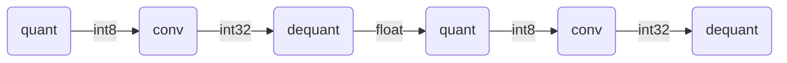

# Quantize

量化是一个经久不衰的问题，量化可以减小模型的大小，运行加载内存，减少数据传输，提高模型性能。以牺牲一定精度的前提下，获得性能的提升。

而在机器学习领域中，已经被验证量化对于网络损失的精度还是可以接受的。

虽然tvm自身带了量化，但是其官方态度比较倾向于使用外部的框架量化然后再导入进tvm。

本文只是相对于tvm自身量化做了什么进行一个简单的分析。

```python
def quantize(mod, params=None, dataset=None):
    # 量化前的通用优化
    mod = prerequisite_optimize(mod, params)
	# 模型进行量化
    calibrate_pass = tvm.transform.module_pass(
        calibrate(dataset), opt_level=1, name="QuantizeCalibrate"
    )
    quant_passes = [partition(), annotate(), calibrate_pass, tvm.relay.transform.InferType()]
    if not current_qconfig().do_simulation:
        quant_passes.append(realize())
    quant_passes.append(_transform.FoldConstant())
    quantize_seq = tvm.transform.Sequential(quant_passes)
    with tvm.transform.PassContext(
        opt_level=3, required_pass=["QuantizeAnnotate", "QuantizeCalibrate", "QuantizeRealize"]
    ):
        with quantize_context():
            mod = quantize_seq(mod)
	
    q_cfg = current_qconfig()
    ...

    return mod


def prerequisite_optimize(mod, params=None):
    optimize = tvm.transform.Sequential(
        [
            _transform.SimplifyInference(),
            _transform.FoldConstant(),
            _transform.FoldScaleAxis(),
            _transform.CanonicalizeOps(),
            _transform.FoldConstant(),
        ]
    )

    if params:
        mod["main"] = _bind_params(mod["main"], params)

    mod = optimize(mod)
    return mod
```

`prerequisite_optimize`会执行5个Pass， 其中`SimplifyInference`、`FoldConstant`、`FoldScaleAxis` 通常组合来用来消除图中的`batchnorm`op，`batch norm`在推理过程中直接表示为乘加操作。具体可以参考[What is FoldScaleAxis optimization](https://discuss.tvm.apache.org/t/what-is-foldscaleaxis-optimization/11913)

`CanonicalizeOps` 则是将`bias_add` op 转换为 `expand_dims` + `add` op的组合，将表达式一般化。

`FoldConstant`： 顾名思义就是将常量折叠，这是一种通用的优化，提前计算掉图中能够计算的op，从而减少推理时的运算量，在tvm中，常量折叠使用的是lower cpu target进行计算。

在上述过程中只是进行一些通用的优化，来使得图更加的简洁。

在这之后就是量化的核心Pass：QuantizePartition、QuantizeAnnotate

## QuantizePartition

首先第一个Pass就是`QuantizePartition`,  其主要的就是插入Op: `CastHint`和`StopFusion`， 插入遵循一定的规则：只处理`nn.conv2d`、`clip`、`nn.relu`、`nn.max_pool2d`、`add`、`multiply`、`nn.global_avg_pool2d`。以上Op都注册了属性`FQPartitionRewrite`的rewrite函数，针对的处理以上场景。

是对图进行分割，分割规则就在`python/tvm/relay/quantize/_partition.py`中定义，在目前推测看partition是为了便于量化后切图切图，使得网络层见传输的数据是int8，更好的提升性能。

```c++
Expr QPartitionExprNode::Realize() const {
  // insert cast hint and stop fusion
  const QConfig& cfg = QConfig::Current();
  Expr ret = CastHint(this->expr, cfg->dtype_input);
  return StopFusion(ret);
}
```

这个实现也很简单就是在当前op之后插入`CastHint`，`CastHint`主要标识这里的输出是int8了，后续接一个`StopFusion`来阻止Op的继续融合，在我们的预想中量化的Op需要满足精度正确，则使用量化的计算 则表示为




在这种场景下较为优化的以融合策略即首层卷积核后一层的量化进行融合，则网络层见数据的传输则是使用了int8，大大减少了带宽需求以及提升性能。

所以在`CastHint`之后强制接一个`StopFusion`来告诉后一层，不能再融合了。以Conv2d为例

```python
@register_partition_function("nn.conv2d")
def conv2d_partition_function(ref_call, new_args, ctx):
    data_cond, data = partition_expr_check(new_args[0])
    kernel_cond, kernel = partition_expr_check(new_args[1])

    assert not kernel_cond
    if data_cond:
        data = new_args[0].realize()
    ret = _forward_op(ref_call, [data, kernel])
    return QPartitionExpr(ret)
```

如果`conv2`的data输入是量化的数据，则在args[0] 进行调用realize, 在args[0]输出之后插入`CastHint`和`StopFusion`。

对于`add`的场景就是比较复杂一点存在4种场景：

```python
def add_partition_generic(ref_call, new_args, ctx):
    lhs_cond, lhs = partition_expr_check(new_args[0])
    rhs_cond, rhs = partition_expr_check(new_args[1])
    if lhs_cond and rhs_cond: # ResNet residual connection
        lhs = new_args[0].realize()
        rhs = new_args[1].realize()
        return QPartitionExpr(_forward_op(ref_call, [lhs, rhs]))
    if not lhs_cond and rhs_cond: # # ResNet residual connection
        rhs = new_args[1].realize()
        return _forward_op(ref_call, [lhs, rhs])
    if lhs_cond and not rhs_cond:
        if _analysis.check_constant(rhs): # batch_norm: add(out, bias)
            return QPartitionExpr(_forward_op(ref_call, [lhs, rhs]))
        lhs = new_args[0].realize() # MobileNetV2 residual connection
        return _forward_op(ref_call, [lhs, rhs])
    if not lhs_cond and not rhs_cond:
        return None

    raise ValueError
```

如果add两个输入都是量化的插入提示，如果量化单个输入是量化的插入单个提示，

`global_avg_pool2d`前一层如果是量化的则需要插入量量化提示。

由于在TVM中使用的是对称量化，所以如果对一个值进行量化之后正的值恒正，负的值恒负。所以对于常见的跟在量化层后面的`op`，比如max_pool 、relu，可以不用做量化。也就是说前一层量化的场景下，这一层直接沿用之前量化计算，将量化CastHint提到后面去做。


## QuantizeAnnotate

这个Pass主要作用是增加op `relay.op.annotation.simulated_quantize`以进行量化操作。其核心rewrite实现是register_annotate_function进行op的重写操作。

目前看支持op为：`nn.conv2d`、`nn.conv1d`、`nn.dense`、`multiply`、`add`、`reshape`、`clip`、`nn.relu`、`strided_slice`、`nn.avg_pool2d`、`nn.batch_flatten`、`transpose`、`annotation.stop_fusion`、`nn.max_pool2d`、`nn.max_pool1d`、`annotation.cast_hint`、`concatenate`、`nn.global_avg_pool2d`、`nn.batch_matmul`

