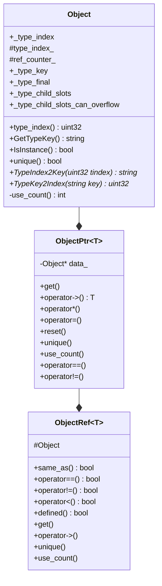
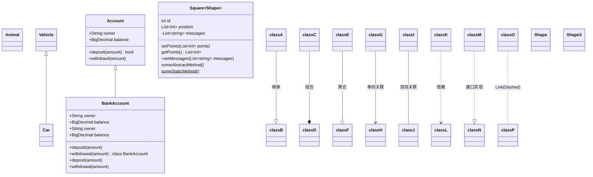
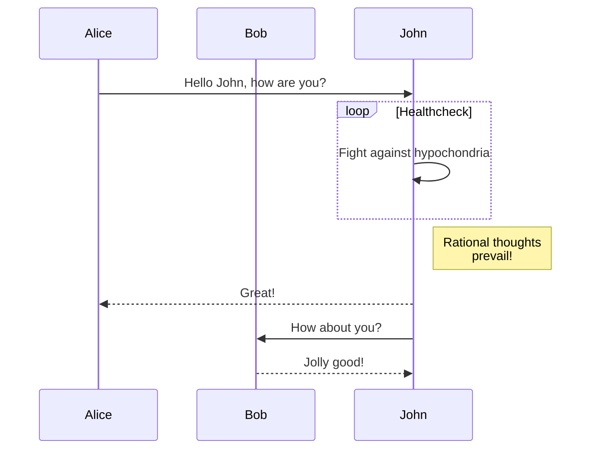
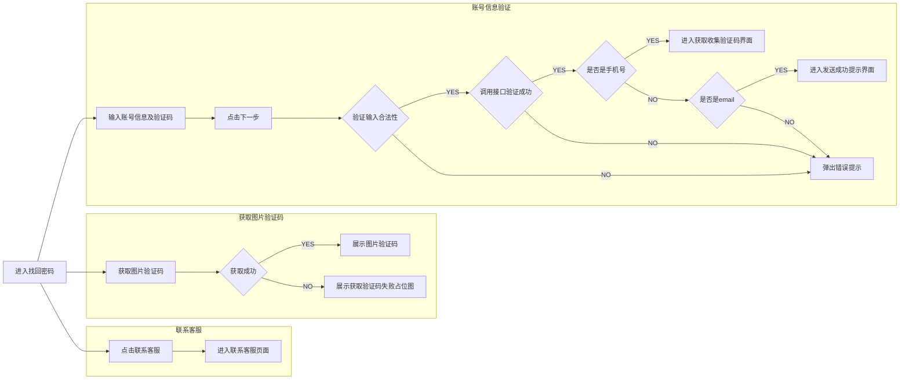

# TVM

[TOC]

## relay frontend

tvm的relay frontend 提供了将源平台的模型转换为relay图表示的能力，也是了解tvm的relay图中较为基础也是比较容易上手的一部分，也便于对于后续的pass优化有很好的了解。

代码目录 `python/tvm/relay/frontend`。tvm提供了mxnet、tensorflow、onnx、pytorch、caffe主流平台的模型转化为relay模型的接口。通俗的讲就是将目标平台的模型文件中的**算子映射到TVM中支持的op**，然后重构出计算图。提供的接口为from_xxxx(), xxxx为对应平台。

在tvm中一个比较重要的数据结构为IRModule，tvm.IRModule，tvm更像一个map，key就是函数名，而val则是函数，除此以外还有type的定义。

这个过程中转换出来得到得到的是mod和 params，mod就是IRModule，而mod是不包含权值的，权值则是在params中以键值对的形式保存。

IRModule则是计算图的定义，则目标平台的模型经过这一步骤被转化为图定义和权值定义。

在构造完图之后一般都会经过一个操作`analysis.free_vars`， 这个操作就是获取到图中函数所有未绑定的变量Var。参数中的一部分Var被分离成了params中的权值，而剩下的一部分则作为函数的输入，但是在权值中找不到。那么就说明这是函数的输入变量。


## relay build

relay build会将模型转换为可执行的对应平台的的lib


## TVM中Object

在tvm中基本上所有的类都来自于Object, 在object.h文件定义，根据注释base class of all  object container，对于任何继承该类的类都应该声明`_type_index`、`_type_key`、`_type_final`、`_type_child_slots`、`_type_child_slots_can_overflow`



`_type_index`:  描述了Object的类型，如果设置为TypeIndex::kDynamic 那么将会在运行时决定`type_index_`，对于其他的类型存在NDArray、String、Map等常用类型。

`_type_key`:  描述对象的名字，比如Object的type_key就是`"runtime.Object"`

`_type_final`: bool类型用来表示该类是否存在子类

`_type_child_slots`: 子类预留slot，主要用于运行时类型检查是否为某一类的实例，如果一个类的`_type_index`在 `[type_index_, type_index_+ _type_child_slots]`之间则说明是某类的子类

`_type_child_slots_can_overflow`: 是否可以不在上述范围中slot的也是子类，即是否可以超过定义预留的slot，如果能明确知道多少子类，没必要使用这个。Object就是这个属性设置为true。

在Object类中，使用了原子操作计数来计数该类被引用了多少次。在对Object类有了一个基本了解之后，现在就可以看看该类内部实现。

两个宏用来定义子类`TVM_DECLARE_BASE_OBJECT_INFO`和`TVM_DECLARE_FINAL_OBJECT_INFO`。

```cpp
#define TVM_DECLARE_BASE_OBJECT_INFO(TypeName, ParentType)                                     \
  static_assert(!ParentType::_type_final, "ParentObj marked as final");                        \
  static uint32_t RuntimeTypeIndex() {                                                         \
    static_assert(TypeName::_type_child_slots == 0 || ParentType::_type_child_slots == 0 ||    \
                      TypeName::_type_child_slots < ParentType::_type_child_slots,             \
                  "Need to set _type_child_slots when parent specifies it.");                  \
    if (TypeName::_type_index != ::tvm::runtime::TypeIndex::kDynamic) {                        \
      return TypeName::_type_index;                                                            \
    }                                                                                          \
    return _GetOrAllocRuntimeTypeIndex();                                                      \
  }                                                                                            \
  static uint32_t _GetOrAllocRuntimeTypeIndex() {                                              \
    static uint32_t tindex = Object::GetOrAllocRuntimeTypeIndex(                               \
        TypeName::_type_key, TypeName::_type_index, ParentType::_GetOrAllocRuntimeTypeIndex(), \
        TypeName::_type_child_slots, TypeName::_type_child_slots_can_overflow);                \
    return tindex;                                                                             \
  }

uint32_t Object::GetOrAllocRuntimeTypeIndex(const std::string& key, uint32_t static_tindex,
                                            uint32_t parent_tindex, uint32_t num_child_slots,
                                            bool child_slots_can_overflow) {
  return TypeContext::Global()->GetOrAllocRuntimeTypeIndex(
      key, static_tindex, parent_tindex, num_child_slots, child_slots_can_overflow);
}
```

主要是覆盖了RuntimeTypeIndex方法行为，通过调用_GetOrAllocRuntimeTypeIndex从Object::GetOrAllocRuntimeTypeIndex 中获取到注册过的或者创建一个新的tindex。

这里通过单例TypeContext管理所有分配出来的即kDynamic类型的tindx

```cp
#define TVM_DECLARE_FINAL_OBJECT_INFO(TypeName, ParentType) \
  static const constexpr bool _type_final = true;           \
  static const constexpr int _type_child_slots = 0;         \
  TVM_DECLARE_BASE_OBJECT_INFO(TypeName, ParentType)
```

TVM_DECLARE_FINAL_OBJECT_INFO 定义一个final的类，也指明了其不可被继承没有子slot。

**至此总结一下Object类在TVM中的作用： 管理类的类型，对于类的继承之间的关系维护，引用计数功能**

这里以BaseExprNode来举例

```cpp
class BaseExprNode : public Object {
 public:
  /*!
   * \brief Span that points to the original source code.
   *        Reserved debug information.
   */
  mutable Span span;

  static constexpr const char* _type_key = "BaseExpr";
  static constexpr const bool _type_has_method_sequal_reduce = true;
  static constexpr const bool _type_has_method_shash_reduce = true;
  static constexpr const uint32_t _type_child_slots = 62;
  TVM_DECLARE_BASE_OBJECT_INFO(BaseExprNode, Object);
};
```

BaseExprNode继承自Object，使用动态分配的tindx，但是对于type_key都对于自身类实现了override。


然后一个类是ObjectPtr，这个是类持有Object的data，使其具有指针的特性。

ObjectRef是更多的是作为一种引用，并没有重载operator->() operaotr*() 操作 而是提供了defined() 和get()方法。通过持有ObjectPtr间接持有Object。


## PYTHON 和FFI互调机制

在TVM中并不是使用开源pybind来实现python和c++之间的互通，而是使用自己实现的FFI这套机制来达到高效的互通。在理解这套机制之前要对其基本的数据结构有所了解。


## TVM中使用cutlass


tvm中新增了cutlass支持，其测试用例在`tests/python/contrib/test_cutlass.py`

先看一个简单的dense 实现使用cutlass需要定义什么。

```python
def get_dense_with_shape(
    data_shape, weight_shape, out_dtype="float16", data_dtype="float16", weight_dtype="float16"
):
    data = relay.var("data", shape=data_shape, dtype=data_dtype)
    weight = relay.var("weight", shape=weight_shape, dtype=weight_dtype)
    return relay.nn.dense(data, weight, out_dtype=out_dtype)

def get_dense(M, N, K, out_dtype="float16", data_dtype="float16", weight_dtype="float16"):
    return get_dense_with_shape((M, K), (N, K), out_dtype, data_dtype, weight_dtype)
```

定义基本的relay构图， 目前约束输入类型为量化int8和float16。

从一个小case开始

```python
def profile_and_build(mod, params, sm, split_k_slices=[1], tmp_dir="./tmp",
    lib_path="compile.so", use_fast_math=False, use_3xtf32=True,):
    mod = partition_for_cutlass(mod)
    mod, num_cutlass_partition = tune_cutlass_kernels(mod, sm, use_3xtf32=use_3xtf32,
        split_k_slices=split_k_slices, profile_all_alignments=True, find_first_valid=False,
        use_multiprocessing=True, tmp_dir=tmp_dir,)
    with tvm.transform.PassContext(opt_level=3):
        lib = relay.build(mod, target="cuda", params=params)
    lib = build_cutlass_kernels(lib, sm, tmp_dir, lib_path, use_fast_math=use_fast_math)
    dev = tvm.device("cuda", 0)
    rt_mod = tvm.contrib.graph_executor.GraphModule(lib["default"](dev))
    return rt_mod, dev, num_cutlass_partition

def verify_dense(func, M, N, K, sm=75, data_dtype="float16", weight_dtype="float16", use_3xtf32=True):
    if not has_cutlass():
        return
    if sm < 80 and data_dtype == "float32":
        return
    mod = tvm.IRModule.from_expr(func)
    np_data = get_random_ndarray((M, K), data_dtype)
    np_weight = get_random_ndarray((N, K), weight_dtype)
    params = None
    rt_mod, dev, num_partition = profile_and_build(mod, params, sm, use_3xtf32=use_3xtf32)
    x = tvm.nd.array(np_data, device=dev)
    w = tvm.nd.array(np_weight, device=dev)
    out = get_output(rt_mod, ["data", "weight"], [x, w])

    assert num_partition > 0
    if True:
        print("CUTLASS:", rt_mod.benchmark(dev, number=1, repeat=600))

def test_dense():
    M = 96
    N = 64
    K = 64
    verify_dense(get_dense(M, N, K, out_dtype="float32"), M, N, K, sm=75)
```

构造dense expr之后直接做成irmod，然后调用cutlass提供的接口`partition_for_cutlass`和`tune_cutlass_kernels`，以及用`build_cutlass_kernels`生成lib。

这三个接口也是主要使用cutlass的接口。就这三个接口一个一个分析主体流程做了什么，

**partition_for_cutlass**

这里主要是定义了哪些op的实现或者融合可以走到cutlass实现中

```python
cutlass_patterns = (
    residual_block_patterns + dense_patterns + conv2d_patterns + conv2d_grad_patterns
)
```

从目前这边看卷积的residual_block、dense、conv2d、conv2d_grad可以走到这些pattern中来。

那么这些pattern的作用是什么？

这里以dense_patterns举例

```python
dense_pat = ("cutlass.dense", make_gemm_pattern(False, None), check_gemm)
dense_bias_pat = ("cutlass.dense_bias", make_gemm_pattern(True, None), check_gemm)
dense_bias_relu_pat = ("cutlass.dense_bias_relu", make_gemm_pattern(True, "relu"), check_gemm)
dense_bias_gelu_fp16_pat = (
    "cutlass.dense_bias_gelu_fp16",
    make_gemm_pattern(True, "gelu"),
    check_gemm,
)
dense_bias_gelu_fp32_pat = (
    "cutlass.dense_bias_gelu_fp32",
    make_gemm_pattern(True, "gelu", out_dtype="float32"),
    check_gemm,
)

dense_patterns = [
    dense_bias_gelu_fp16_pat,
    dense_bias_gelu_fp32_pat,
    dense_bias_relu_pat,
    dense_bias_pat,
    dense_pat,
    ("cutlass.batch_matmul", make_batch_matmul_pattern(), check_batch_matmul),
]
```

make_gemm_pattern 以一种语法糖的方式重新构造了一个匹配图。通过自定义一些匹配节点类型来实现描述计算图的模式

```python
def make_gemm_pattern(with_bias=True, with_act=None, out_dtype="float16"):
    """Create a pattern for dense op followed by activations."""
    data = wildcard()
    weight = wildcard()
    bias = wildcard()
    gemm = is_op("nn.dense")(data, weight)
    if with_bias:
        add_or_bias_add = is_op("add") | is_op("nn.bias_add")
        gemm_out = add_or_bias_add(gemm, bias)
    else:
        gemm_out = gemm

    if with_act is None:
        return gemm_out
    if isinstance(with_act, str) and with_act == "relu":
        return is_op("nn.relu")(gemm_out)
```

wildcard 通配任何输入 对于gemm来说存在两个通配输入，而本身的is_op说明了这个节点必须是nn.dense。随后定义了dense的融合模式pattern，比如dense可以和bias、act激活函数融合。

而后的check_gemm，则是在后续流程中对gemm的通用模式进行校验，这里gemm实际上只校验了dtype属性，对于cutlass中调用gemm只支持float16和int8的输入数据类型。

对于conv2d的check可能更加复杂 包含了校验其layout以及是否depthwise_conv2d。

所以对于一个pattern来说，定义了通用匹配规则：即什么样的计算子图能够匹配使用cutlass，然后check函数对内部的具体参数进行了校验。

如果这里执行了绑定param，则会调用一些pass来消除网络中的bn以及常量节点，最为最后的mod，其推理输入变少。

这个函数的重点在于以下代码

```python
seq = Sequential(
    [
        transform.InferType(),
        transform.MergeComposite(cutlass_patterns),
        transform.AnnotateTarget(["cutlass"], include_non_call_ops=False),
        transform.PartitionGraph(bind_constants=False),
    ]
)
seq(mod)
```

InferType是推理网络中输出的type，MergeComposite则是将匹配到的Expr 封装成带有pattern name attr的Function。

```c++
Expr MergeComposite(const Function& func, const Array<runtime::String>& pattern_names,
                    const Array<DFPattern>& patterns, const std::vector<PackedFunc>& checks,
                    const IRModule& m) {
  ICHECK_EQ(pattern_names.size(), patterns.size());
  Function merged_func = func;
  // merge the patterns one-by-one in order
  for (size_t i = 0; i < patterns.size(); i++) {
    Map<String, ObjectRef> attrs;
    attrs.Set("Composite", pattern_names[i]);
    merged_func = Downcast<Function>(PartitionPattern(patterns[i], merged_func, attrs, checks[i]));
    merged_func = InferType(merged_func, m);
  }
  return std::move(merged_func);
}

Function InferType(const Function& expr, const IRModule& m) {
  IRModule mod(m);
  mod->Update(mod->GetGlobalVar("main"), expr);
  mod = transform::InferType()(mod);
  return Downcast<Function>(mod->Lookup("main"));
}
```

在对Dense 使用该pass之后，可以看到

```
def @main(%data: Tensor[(96, 64), float16], %weight: Tensor[(64, 64), float16]) -> Tensor[(96, 64), float32] {
  nn.dense(%data, %weight, units=None, out_dtype="float32") /* ty=Tensor[(96, 64), float32] */
}

def @main(%data: Tensor[(96, 64), float16], %weight: Tensor[(64, 64), float16]) -> Tensor[(96, 64), float32] {
  %0 = fn (%FunctionVar_0_0: Tensor[(96, 64), float16], %FunctionVar_0_1: Tensor[(64, 64), float16], PartitionedFromPattern="nn.dense_", Composite="cutlass.dense") -> Tensor[(96, 64), float32] {
    nn.dense(%FunctionVar_0_0, %FunctionVar_0_1, units=None, out_dtype="float32") /* ty=Tensor[(96, 64), float32] */
  };
  %0(%data, %weight) /* ty=Tensor[(96, 64), float32] */
}
```

在原来的nn.dense之外多加了一层function 封装了Composite属性，属性即pattern的名字。然后调用%0定义的fn。**综上MergeComposite 就是标记这部分op子图可以使用cutlass来运行。**

AnnotateTarget 这个Pass的功能相对来说说比较简单，就是标记哪些op应该使用cutlass编译器，而不是使用原来的后端编译器。

```
def @main(%data: Tensor[(96, 64), float16], %weight: Tensor[(64, 64), float16]) -> Tensor[(96, 64), float32] {
  %0 = annotation.compiler_begin(%data, compiler="cutlass") /* ty=Tensor[(96, 64), float16] */;
  %1 = annotation.compiler_begin(%weight, compiler="cutlass") /* ty=Tensor[(64, 64), float16] */;
  %2 = fn (%FunctionVar_0_0: Tensor[(96, 64), float16], %FunctionVar_0_1: Tensor[(64, 64), float16], PartitionedFromPattern="nn.dense_", Composite="cutlass.dense") -> Tensor[(96, 64), float32] {
    nn.dense(%FunctionVar_0_0, %FunctionVar_0_1, units=None, out_dtype="float32") /* ty=Tensor[(96, 64), float32] */
  };
  %3 = %2(%0, %1) /* ty=Tensor[(96, 64), float32] */;
  annotation.compiler_end(%3, compiler="cutlass") /* ty=Tensor[(96, 64), float32] */
}
```

然后是切分子图PartitionGraph， 对于虽然使用cutlass也是在gpu backend上跑的，但是这边后面为了更好的处理图，将cutlass子图部分给切出来。

```
def @main(%data: Tensor[(96, 64), float16], %weight: Tensor[(64, 64), float16]) -> Tensor[(96, 64), float32] {
  @tvmgen_default_cutlass_main_0(%data, %weight) /* ty=Tensor[(96, 64), float32] */
}

def @tvmgen_default_cutlass_main_0(%cutlass_0_i0: Tensor[(96, 64), float16], %cutlass_0_i1: Tensor[(64, 64), float16], Inline=1, Compiler="cutlass", global_symbol="tvmgen_default_cutlass_main_0", Primitive=1) -> Tensor[(96, 64), float32] {
  %0 = fn (%FunctionVar_0_0: Tensor[(96, 64), float16], %FunctionVar_0_1: Tensor[(64, 64), float16], PartitionedFromPattern="nn.dense_", Composite="cutlass.dense") -> Tensor[(96, 64), float32] {
    nn.dense(%FunctionVar_0_0, %FunctionVar_0_1, units=None, out_dtype="float32") /* ty=Tensor[(96, 64), float32] */
  };
  %0(%cutlass_0_i0, %cutlass_0_i1) /* ty=Tensor[(96, 64), float32] */
}
```

得到上面的子图就可以对Compiler类型的op单独提取出来进行tune_cutlass_kernel。

**tune_cutlass_kernels**

```python
def tune_cutlass_kernels(mod, sm, use_3xtf32=True, split_k_slices=[1],
    profile_all_alignments=False, find_first_valid=False,
    use_multiprocessing=False, tmp_dir="./tmp",):
    gemm_profiler = CutlassGemmProfiler(sm, _get_cutlass_path(), tmp_dir)
    conv2d_profiler = CutlassConv2DProfiler(sm, _get_cutlass_path(), tmp_dir)
    num_cutlass_partition = 0
    for var in mod.get_global_vars():
        fun_name = var.name_hint
        if "cutlass" in fun_name:
            ...
            if "conv2d" in op_type:
                ...
                new_attrs.update(handle_conv2d(...))
            elif "batch_matmul" in op_type:
                new_attrs.update(handle_batch_matmul(...))
            elif "dense" in op_type:
                new_attrs.update(handle_dense(...))
            else:
                raise ValueError("%s unsupported composite" % op_type)

            new_attrs = tvm.ir.make_node("DictAttrs", **new_attrs)
            new_func = relay.Function(...)
            mod.update_func(var, new_func)

    return mod, num_cutlass_partition
```

tune_cutlass_kernels的实现也是相对来说流程很清晰，获取到cutlass func，只要名字中存在cutlass，就是要使用cutlass处理的op在上一步PartitionGraph中单独切出来的tvmgen_default_cutlass_main_0 就是要单独调优处理的函数。

这里的gemm_profiler和conv2d_profiler是对cutlass codegen调用以及性能profile。对于不同的op存在不同的profiler。

而在handle_conv2d, handle_batch_matmul, handle_dense,  封装调用的返回属性，主要是将cutlass的源代码kernel给编译进来了，以及调用profiler。其主要流程是调用了select_gemm_kernel这个函数。这个函数就是使用之前的profiler(CutlassGemmProfiler, CutlassConv2DProfiler)来对各种kernel进行profile操作，选择出最优kernel或者默认的kernel。

对于Profiler `__init__`方法 初始化ProfileEngine，`get_default`方法获取默认的kernel实现，`select_op`为profile核心实现，而`profile`方法则是包含了选择合适的op然后调用`create_gemm_operator_with_epilogue`或者`create_conv2d_operator_with_epilogue`封装成opdef 。

**select_op**

```python
```


## Transform Pass

- InferType
- FoldScaleAxis
- RemoveUnusedFunctions
- SimplifyInference
- FastMath
- CanonicalizeOps
- DeadCodeElimination
- FoldConstant
- FuseOps
- DefuseOps
- CombineParallelConv2D
- CombineParallelDense
- CombineParallelBatchMatmul
- BatchingOps
- AlterOpLayout
- ConvertLayout
- Legalize
- MergeComposite
- ToANormalForm
- CanonicalizeCast
- PartitionGraph
- AnnotateTarget
- Inline
- PlanDevices
- ToMixedPrecision


## 有趣的链接

[TVM InferBound Pass](https://tvm.apache.org/docs/arch/inferbound.html)

[Relay Visualize, Relay Debug 脚本](https://tvm.apache.org/docs/how_to/work_with_relay/using_relay_viz.html)

[Dense Cpu 优化](https://tvm.apache.org/docs/how_to/optimize_operators/opt_gemm.html)

[MLSys](https://proceedings.mlsys.org/paper/2022)

[Relay Viz](https://github.com/hcho3/relayviz)

[Graph Partition RFC](https://discuss.tvm.apache.org/t/rfc-byoc-an-extended-graph-partitioning-flow/6028/2)

[Graph Patttern Match](https://discuss.tvm.apache.org/t/rfc-relay-program-matching-for-relay-pt-1-a-pattern-language/5833/25)

## 单笔提交修改

[batch matmul int8 support && batch_matmul quantization](https://github.com/apache/tvm/commit/90dce48de6ca74a439ed24fc3a3d80d57b305dd0)

[引入TensorRT 以及Cutlass的修改](https://github.com/apache/tvm/pull/11979/files)

[pytorch front end 添加l1 loss mseloss](https://github.com/apache/tvm/pull/11978/files)

[onnx front end 添加op支持](https://github.com/apache/tvm/pull/11894/files)

[表达式简化, add add相消](https://github.com/apache/tvm/pull/9671/files#diff-c75f1092effd03b7a1415b51dab46e72a2ea137bf8051af9181bedbbf1d147a9)

[Relay 可视化 Call Op](https://github.com/apache/tvm/commit/55cfc4ad2df0120411b6b5ae2a2f28d8b467a25a#diff-ffafde7b705a970be1cee1482b34bf75960d1b402c1cafa186344885ecb77f74)

## 论文

[Attention is All your Need](https://arxiv.org/pdf/1706.03762.pdf)


更多Mermaid用法参考 [mermaid js](https://mermaid-js.github.io/mermaid/#/classDiagram)










